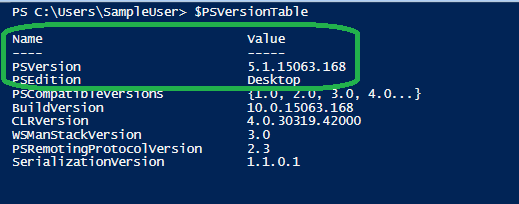

# AzSK.AAD PowerShell module

## Contents

  -  [Overview](Readme.md#overview)
  -  [Setup](Readme.md#Setup)
  	 -  [Installation Guide](Readme.md#installation-guide)
  -  [Getting Started](Readme.md#getting-started)
  	 -  [Import AAD Scanner module](Readme.md#import-aad-scanner-module)
 	   -  [Scan your AAD resources](Readme.md#scan-your-aad-resources)
  -  [FAQs](Readme.md#faqs)
  -  [Support](Readme.md#Support)
 
  
  
----------------------------------------------

## Overview
Security Scanner for AAD (now known as Entra ID) helps you keep your Entra ID objects such as app registrations and enterprise applications configured securely. You can run the AAD Scanner standalone in a PowerShell console.

> At its core, the AAD Scanner is a PowerShell module. This can be run locally from the PS console after installation. This is as simple as running PS in non-Admin mode and running the cmds as shown below:

----------------------------------------------

### Setup 

## Installation Guide

>**Pre-requisites**:
> - PowerShell 5.0 or higher. 

1. First verify that prerequisites are already installed:  
    Ensure that you have PowerShell version 5.0 or higher by typing **$PSVersionTable** in the PowerShell ISE console window and looking at the PSVersion in the output as shown below.) 
 If the PSVersion is older than 5.0, update PowerShell from [here](https://www.microsoft.com/en-us/download/details.aspx?id=54616). 
 
 <kbd>
   
</kbd>


2. Install the AAD Scanner (AzSK.AAD) PS module:  
	  
```PowerShell
  Install-Module AzSK.AAD -Scope CurrentUser -AllowClobber -Force
```

Note: 

  - The `AzSK.AAD` module depends on the following modules:
    - Az.Accounts
    - Az.Resources
    - Microsoft.Graph.Applications
    - Microsoft.Graph.Users
    - Microsoft.Graph.Groups
    - Microsoft.Graph.Identity.DirectoryManagement
    - Microsoft.Graph.DirectoryObjects
    - Microsoft.Graph.Authentication
  
  - The Az.Accounts module requires .Net Framework 4.7.2. If your machine does not have .Net Framework 4.7.2, you may need to independently install it.

## Getting Started

## Import AAD Scanner module
Firstly AAD scanner module should be imported in the powershell session before using the scan commands. To import AAD module run below command.
```PowerShell
Import-Module AzSK.AAD
```

## Scan your AAD resources

Use the commands below based on if you wish to scan the entire tenant or as an end user. Even if you do not have admin permissions to the tenant, you can _still_ use the tenant version of the command. In such a case, the command will scan the controls that it can based on your permissions. 

When using the 'tenant' cmdlet, a desired number of objects in the tenant of chosen types (or 'all' types) are also scanned. 

When using the 'user' cmdlet, objects of chosen (or all) types that are owned by the current user are scanned for security issues and best practices.


### Scanning tenant-wide:
```PowerShell
Get-AzSKAADSecurityStatusTenant

Get-AzSKAADSecurityStatusTenant -TenantId <tid>

Get-AzSKAADSecurityStatusTenant -TenantId <tid> -ObjectType [AppRegistration|EnterpriseApplication|All] -MaxObj 2 -IncludeDetailedResult
```

### Scanning at a 'user' scope:
```PowerShell
Get-AzSKAADSecurityStatusUser

Get-AzSKAADSecurityStatusUser -TenantId <tid>

Get-AzSKSecurityStatusUser -TenantId <tid> -ObjectType [AppRegistration|EnterpriseApplication|All] -MaxObj 2 -IncludeDetailedResult
```

Note: You can get your AAD tenantId by running the following in PS after installing the `AzSK.AAD` module: <br>`$tenantId = (Get-AzureADTenantDetail).ObjectId`

Outcome of the analysis is printed on the console during SVT execution and a CSV and LOG files are 
also generated for subsequent use.

The CSV file and LOG file are generated under a Org-specific sub-folder in the folder  
*%LOCALAPPDATA%\Microsoft\AzSK.AADLogs\Org_[yourOrganizationName]*  
E.g.  
C:\Users\UserName\AppData\Local\Microsoft\AzSK.AADLogs\Org_[yourOrganizationName]\20181218_103136_GADS

### FAQs

#### Error message: "Running scripts is disabled on this system..."
This is an indication that PowerShell script loading and execution is disabled on your machine. You will need to enable it before the ADOScanner installation script (which itself is a PowerShell script) can run. 
```PowerShell
Get-ExecutionPolicy -Scope CurrentUser
```
If you run above command in the PS console, you will likely see that the policy level is either 'Restricted' or 'Undefined'. For AzSK cmdlets to run, it needs to be set to 'RemoteSigned'.
To resolve this issue run the following command in your PS console:
```PowerShell
Set-ExecutionPolicy -ExecutionPolicy RemoteSigned -Scope CurrentUser
```
The execution policy setting will be remembered and all future PS consoles opened in non-Admin (CurrentUser) mode will apply the 'RemoteSigned' execution policy.


#### How to register with PSGallery
Use below command :
```PowerShell
Register-PSRepository -Name PSGallery -SourceLocation https://www.powershellgallery.com/api/v2/ -InstallationPolicy Trusted
```

### Support
- For any other issues or feedback please drop a mail to <a href="mailto:azskadosup@microsoft.com">ADO Scanner Support</a>
